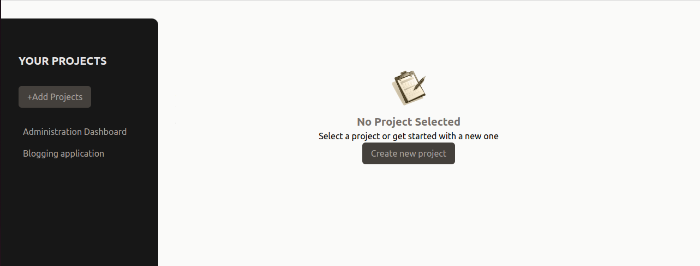
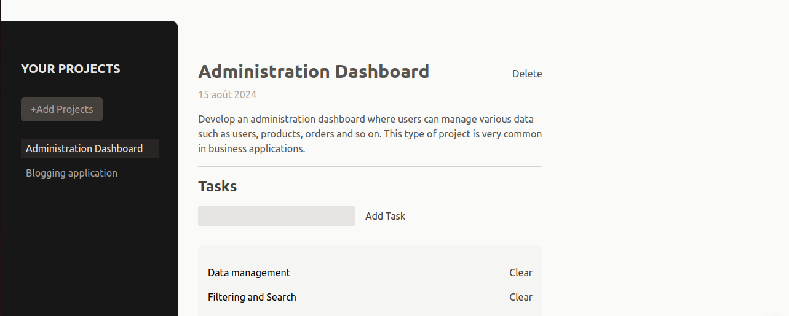

# Project Management Application

This project is a simple and efficient project management application built with React. It allows users to manage tasks and projects, providing an intuitive interface for adding new tasks, viewing existing projects, and handling various project management operations.




## Features

**Task Management:** Add, edit, and delete tasks within projects.

**Project Overview:** Get a clear view of all ongoing projects and the tasks associated with each.

**Responsive Design:** The application is fully responsive, ensuring it works on all devices.

## Technologies Used

**React:** A JavaScript library for building user interfaces.

**Vite:** A build tool that provides a fast and optimized development experience.

**CSS:** Custom styling for the user interface.

**Tailwind CSS:** A utility-first CSS framework for rapid UI development.

## Installation

To run this project locally, follow these steps:

**1.Clone the repository:**
```bash
git clone https://github.com/your-username/project-management.git
```

**2.Navigate to the project directory:**
```bash
cd project-management
```

**3.Install the dependencies:**
```bash
npm install
```

**4.Start the development server:**
```bash
npm run dev
```

**5.Open your browser:**
Navigate to `http://localhost:5173` to see the application in action.


## Project Structure

**src/**

**assets/:** Contains images, fonts, and other static resources.

**components/:** Includes reusable components such as Button.jsx, Input.jsx, Modal.jsx, Tasks.jsx, and more.

**store/:** Handles the state management for the application.

**App.jsx:** The main component that sets up the routes and renders the application.

**index.css:** The global CSS file for styling.

**main.jsx:** The entry point of the application.

## .gitignore

The `.gitignore` file ensures that certain files and directories are not tracked by Git, such as:

Log files (e.g., `npm-debug.log`, `yarn-error.log`)
`node_modules/` directory
Build directories like `dist/`
Editor-specific directories and files like `.vscode/`, `.idea/`, etc.

## License

This project is licensed under the MIT License - see the LICENSE file for details.


